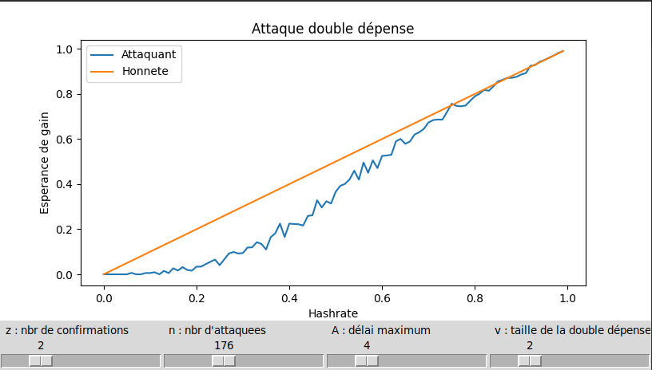
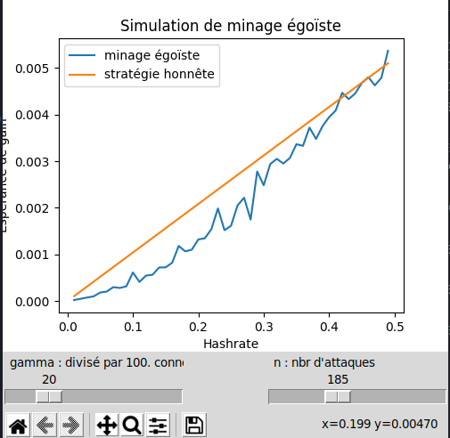

# Projet de Cryptofinance

###### Aymeric Noël & Antoine Mecker


#### Organisation du repo

Deux fichiers pythons, l'un concerne la simulation de l'attaque à la double dépense et l'autre est une simulation de minage égoïste.

Le dossier pic contient deux images utilisées pour illustrer ce README.


#### Double dépense

Pour lancer le code il faut taper dans la console:

```
python3 DoubleSpend.py
```

Une fenêtre doit s'ouvrir avec un graphique. Il y a plusieurs curseurs qu'il est possible de modifier.

Les paramètres sont: 

- z, le nombre de confirmations demandées par le vendeur
- n, le nombre de cycles d'attaque
- A, le délai maximum acceptable pour l'attaquant. Délai entre la chaîne officielle et celle de l'attaquant
- v, le montant de la double dépense





#### Minage égoïste

Pour lancer le code il faut taper dans la console:

```
python3 SelfishMining.py
```

Une fenêtre doit s'ouvrir avec un graphique. Il y a plusieurs curseurs qu'il est possible de modifier.

Les paramètres sont: 

- gamme, la connectivité de l'attaquant 
- n, le nombre de cycles d'attaque





